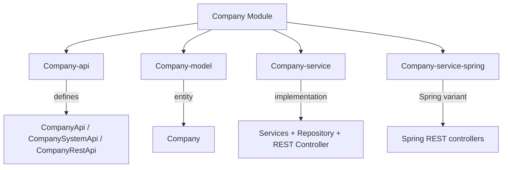

# Company Module

The **Company** module provides business entity management for the Water Framework. It handles company data with full CRUD operations, role-based access control, REST API exposure, and multi-tenant ownership support.

## Architecture Overview



## Sub-modules

| Sub-module | Description |
|---|---|
| **Company-api** | Defines `CompanyApi`, `CompanySystemApi`, `CompanyRestApi`, and `CompanyRepository` interfaces |
| **Company-model** | Contains the `Company` JPA entity |
| **Company-service** | Service implementations, repository, and REST controller |
| **Company-service-spring** | Spring MVC REST controllers and Spring Boot application |

## Company Entity

```java
@Entity
@AccessControl(availableActions = { CrudActions.class },
    rolesPermissions = {
        @DefaultRoleAccess(roleName = "companyManager", actions = { "save","update","find","find_all","remove" }),
        @DefaultRoleAccess(roleName = "companyViewer", actions = { "find","find_all" }),
        @DefaultRoleAccess(roleName = "companyEditor", actions = { "save","update","find","find_all" })
    })
public class Company extends AbstractJpaEntity implements ProtectedEntity, SharedEntity, OwnedResource { }
```

### Entity Fields

| Field | Type | Constraints | Description |
|---|---|---|---|
| `businessName` | String | `@NotNull`, `@NoMalitiusCode`, max 255 | Company legal name |
| `invoiceAddress` | String | `@NotNull`, `@NoMalitiusCode`, max 255 | Billing address |
| `city` | String | `@NotNull`, `@NoMalitiusCode`, max 255 | City |
| `postalCode` | String | `@NotNull`, `@NoMalitiusCode`, max 255 | Postal/ZIP code |
| `nation` | String | `@NotNull`, `@NoMalitiusCode`, max 255 | Country |
| `vatNumber` | String | `@NotNull`, `@NoMalitiusCode`, unique, max 255 | VAT identification number |
| `ownerUserId` | long | — | Owner user ID for access control |

The entity implements both `SharedEntity` (for multi-tenant sharing) and `OwnedResource` (for ownership-based filtering).

## Default Roles

| Role | Permissions |
|---|---|
| **companyManager** | `save`, `update`, `find`, `find_all`, `remove` |
| **companyViewer** | `find`, `find_all` |
| **companyEditor** | `save`, `update`, `find`, `find_all` |

## REST Endpoints

| HTTP Method | Path | Description |
|---|---|---|
| `POST` | `/water/companies` | Create company |
| `PUT` | `/water/companies` | Update company |
| `GET` | `/water/companies/{id}` | Find company by ID |
| `GET` | `/water/companies` | Find all companies (paginated) |
| `DELETE` | `/water/companies/{id}` | Remove company |

## Usage Example

### REST API

```bash
# Create company
POST /water/companies
{
  "businessName": "Acme Corporation",
  "invoiceAddress": "123 Business Street",
  "city": "New York",
  "postalCode": "10001",
  "nation": "USA",
  "vatNumber": "US123456789"
}

# Find company
GET /water/companies/1

# Find all with pagination
GET /water/companies?delta=10&page=1
```

### Programmatic Usage

```java
@Inject
private CompanyApi companyApi;

// Create
Company company = new Company("Acme Corp", "123 Business St", "New York",
                              "10001", "USA", "US123456789", userId);
company = companyApi.save(company);

// Update
company.setBusinessName("Acme Corporation Updated");
company = companyApi.update(company);

// Find all with pagination
PaginableResult<Company> all = companyApi.findAll(null, 10, 1, null);

// Delete
companyApi.remove(company.getId());
```

## Importing the Module

**OSGi:**
```gradle
implementation group: 'it.water.company', name: 'Company-api', version: project.waterVersion
implementation group: 'it.water.company', name: 'Company-model', version: project.waterVersion
implementation group: 'it.water.company', name: 'Company-service', version: project.waterVersion
```

**Spring:**
```gradle
implementation group: 'it.water.company', name: 'Company-service-spring', version: project.waterVersion
```

## Dependencies

- **Core-api** — Base interfaces and annotations
- **Core-model** — `AbstractJpaEntity`, `ProtectedEntity`, `SharedEntity`, `OwnedResource`
- **Core-security** — `@AccessControl`, `@DefaultRoleAccess`
- **Repository / JpaRepository** — Persistence layer
- **Rest** — REST controller infrastructure
- **SharedEntity** — Multi-tenant entity sharing support
